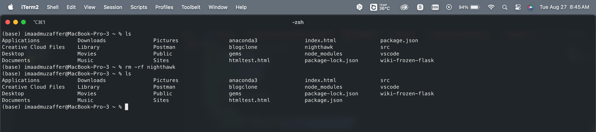
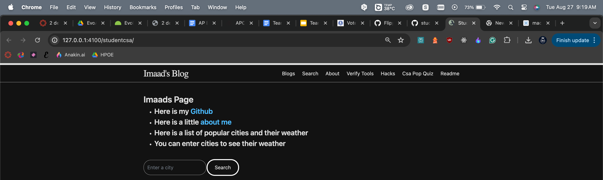

# Picture deleting nighthawk directory with studentcsa repo

# Me and tanay helping Brandon and Jackson

- Brandon had a tough time getting into kasm so we were a little bit behind and got a bundle not found error which I was unable to troubleshoot
- Jackson had a similar error with Ruby but ran out of time
  

# This is my own restored studentcsa page

